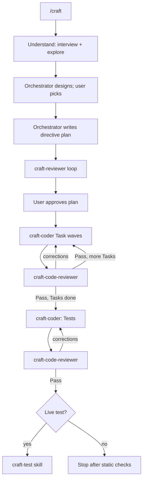

# craft

A Cursor plugin for building features the right way.

AI agents are great at producing code that *works* and bad at producing code that is clean, modular, readable, and idiomatic. `craft` fixes that by making the main agent an **autonomous senior developer**: it owns understanding, architecture, and the plan, while focused subagents explore, review, and implement. Each agent carries its own instructions; the orchestrator owns every gate and proves the finished feature by running it locally.

The `/craft` workflow is one elastic path: understand, interview, design (orchestrator), write a directive plan, review it, get approval, implement under fresh-context code review, then offer to live-test. Cost scales with the work — a small change gets a short design and plan. The user always picks the design; the plan gate always fires.

Every run asks before live-testing at the end; say no and it stops after the static checks.

## What's inside

| Component | Type | Role |
|---|---|---|
| `craft` | skill (`/craft`) | Owns architecture and the plan; directs subagents; gates design and plan; live-tests |
| `craft-plan` | skill (`/craft-plan`) | Co-authors a dense plan one step at a time — review and approval per step — then implements hands-off |
| `craft-design` | skill (`/craft-design`) | Mocks 3–5 UI directions in one Canvas, iterates to a chosen design, then implements the UI |
| `craft-test` | skill (`/craft-test`) | Proves a feature works by running it live; standalone or as craft's final step |
| `craft-monitor` | skill (`/craft-monitor`) | Checks a shipped feature against live production data; reports problems and improvements worth considering |
| `craft-research` | skill (`/craft-research`) | Researches a topic across many sources and produces a refined doc in `Docs/` |
| `craft-coder` | subagent | Implements one Task from a directive plan (also usable standalone) |
| `craft-code-reviewer` | subagent (readonly) | Fresh-context review of an implementation wave — Pass / Revise |
| `craft-polisher` | subagent | Architect polish pass over a working diff (also usable standalone) |
| `craft-reviewer` | subagent (readonly) | Gates a directive plan — Pass / Needs changes |

Each agent is self-contained — quality bar and role judgment live in its own file. The skill keeps its plan template and architecture judgment under `skills/craft/references/`.

## The workflow



### Artifacts it produces (in the target repo)

- `docs/plans/<feature>.md` — the implementation plan. Directive-level (where and what, contracts where precision matters), written by the orchestrator.
- `docs/monitor/<feature>.md` — written by `craft-monitor`. How the feature works, how to reach its data, four to six checks as literal queries with their observed normal ranges, and the running log of findings.

## Install

### Marketplace (recommended)

Open the Marketplace panel in Cursor, search for **craft**, and install — choosing project or user scope. Nothing else to set up.

> Not yet published. Until it's live on the [Cursor Marketplace](https://cursor.com/marketplace), use the local install below.

### Local (development)

A plugin loads when it lives under `~/.cursor/plugins/local/` with its `.cursor-plugin/plugin.json` at the root. Clone it straight into place:

```bash
git clone git@github.com:AidenHadisi/craft.git ~/.cursor/plugins/local/craft
```

Or, if you keep your working copy elsewhere, symlink the repo **into** the plugins folder (this is the supported direction — link your repo *in*, not the other way around):

```bash
ln -s /path/to/your/craft ~/.cursor/plugins/local/craft
```

Then run **Developer: Reload Window** from the Command Palette. Confirm `/craft` appears in Settings → Rules and that the `craft-*` subagents are available.

## Publishing

Cursor plugins are distributed as public Git repositories reviewed by the Cursor team — there's no publish CLI. To release a new version:

1. Bump `version` in `.cursor-plugin/plugin.json` (semver).
2. Commit a logo to `assets/` and add `"logo": "assets/<file>.svg"` to the manifest (relative paths resolve against the repo on GitHub).
3. Push to the public repo, then submit the repo URL at [cursor.com/marketplace/publish](https://cursor.com/marketplace/publish).

Components are auto-discovered from their default folders (`skills/`, `agents/`, `rules/`, `commands/`, `hooks/`), so the manifest only needs metadata — no path wiring required.

## Usage

```
/craft add OAuth login for the dashboard
```

You always pick the design; the plan is always reviewed by `craft-reviewer` and then approved by you. Parallel coder waves run only for file-disjoint Tasks with pinned contracts; otherwise sequential. Each wave is reviewed by `craft-code-reviewer`, then static checks run, and it asks before live-testing — decline and it stops there.

`craft-coder`, `craft-code-reviewer`, `craft-polisher`, and `craft-reviewer` are usable inside or outside `/craft`.

When the feature is too complex to plan in one shot but you don't want to sit through every code slice, co-author the plan instead — one step at a time, each reviewed and approved before the next, then a fully hands-off build:

```
/craft-plan add OAuth login for the dashboard
```

For UI work, compare 3–5 mock directions in one Canvas, refine or combine them, then implement the one you pick:

```
/craft-design redesign the analytics dashboard
```

Once it ships, check on it. Standalone — invoke it whenever you want to know how something is behaving, whether craft built it or not:

```
/craft-monitor site-evaluation
```

The first invocation learns the feature — its tables, log streams, metrics, and the exact way to query each — and writes `docs/monitor/<feature>.md` with four to six checks. Run in the session that just built the feature, it reuses what's already in context and researches only the gaps. Either way every check is **run before it's written down**, so the recorded normal range is an observed value rather than a guessed threshold.

Every invocation after that follows the file: work the checks, compare each against its normal range and the log, then look around for what the checks don't cover. What comes back is problems and observations alike — a step eating the runtime or output that's weak for one kind of input is worth knowing even though nothing is broken. Most runs report nothing new, and that's the point: the bar is whether a person would want to know, not whether the agent found something to say.

## Design notes

- **Orchestrator owns architecture.** Design and plan stay in one context so decisions don't die in a handoff.
- **Delegation for labor.** Exploration, coding, and review use subagents; judgment stays with the orchestrator.
- **Self-contained agents.** Each agent owns its instructions — no shared standards dump. The plan template stays under `skills/craft/references/`.
- **Diffs, not reports.** Coder reports are claims; `craft-code-reviewer` owns the Pass/Revise gate — the orchestrator accepts findings, loops coders, and advances only on Pass.
- **Prove it runs.** Every run ends with static checks, then offers live testing — run locally with real credentials, stub side effects, never mutate prod, revert every temporary change.
- **Readonly where it counts.** Exploration and review agents are readonly; they inform the orchestrator but never edit artifacts.

## License

MIT — see [LICENSE](LICENSE).
