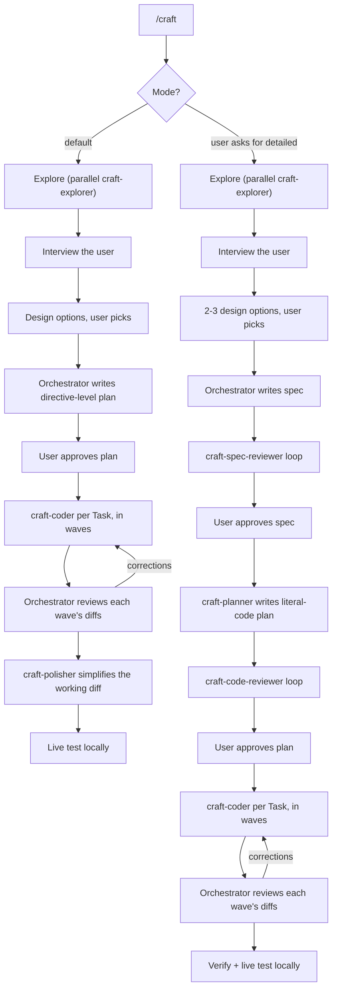

# craft

A Cursor plugin for building features the right way.

AI agents are great at producing code that *works* and bad at producing code that is clean, modular, readable, and idiomatic. `craft` fixes that by making the main agent an **autonomous senior developer**: it plans, directs, and judges, while fast parallel subagents do the labor — exploring, coding, reviewing. Every wave of coder output is reviewed as diffs against a strict quality lens, and the finished feature is proven by running it locally, not just reading it.

One skill, two modes:

- **Quick (default)** — explore, interview the user on open decisions, present design options, write a directive-level plan, get approval, implement with parallel coders under heavy review, polish, then live-test. Two approval gates: design choice, plan.
- **Detailed (on explicit request)** — adds a reviewed spec and a literal-code plan written by a dedicated planner and audited by a code reviewer before a single line ships. Three approval gates: design choice, spec, plan.

## What's inside

| Component | Type | Role |
|---|---|---|
| `craft` | skill (`/craft`) | Orchestrates both modes; directs subagents, reviews every wave, live-tests the result |
| `craft-explorer` | subagent (readonly) | Gathers logic + conventions for one slice, in parallel |
| `craft-planner` | subagent | Writes the detailed-mode plan: architecture, Tasks with literal code, tests |
| `craft-coder` | subagent | Implements one Task — verbatim for literal code, idiom-following for directives |
| `craft-polisher` | subagent | Behavior-preserving simplification pass over the working diff (quick mode) |
| `craft-spec-reviewer` | subagent (readonly) | Gates the spec for clarity & completeness (detailed mode) |
| `craft-code-reviewer` | subagent (readonly) | Reviews the planned code on paper before it ships (detailed mode) |

Reference files carry the workflows and design knowledge:

| Reference | Used by | Covers |
|---|---|---|
| `references/quick-mode.md` | orchestrator | The nine quick-mode steps and two gates |
| `references/detailed-mode.md` | orchestrator | The ten detailed-mode steps and three gates |
| `references/architecture-principles.md` | `craft-planner` | Where to cut boundaries, dependency rules, complexity budget, plan template |
| `references/design-principles.md` | `craft-planner`, orchestrator | "Less code is better" + the don't-list, function shape, naming, errors, patterns |
| `references/testing-principles.md` | `craft-planner`, orchestrator | Test what matters, repo idioms, mocking only at boundaries |
| `references/live-testing.md` | orchestrator | Running locally, credentials, stubbing side effects, browser testing, safety rules |
| `references/example-spec.md` | orchestrator | A worked example spec (detailed mode) |
| `references/example-plan.md` | `craft-planner` | A worked example literal-code plan (detailed mode) |
| `references/example-plan-quick.md` | orchestrator | A worked example directive-level plan (quick mode) |

## The workflow



### Artifacts it produces (in the target repo)

- `docs/plans/<feature>.md` — the implementation plan. Quick mode: directive-level (where and what, contracts where precision matters), written by the orchestrator. Detailed mode: complete literal code per subtask plus a Tests section, written by `craft-planner`.
- `docs/specs/<feature>.md` — detailed mode only. The spec: idea and requirements, readable by engineers and product managers alike. No code.

## Install

### Marketplace (recommended)

Open the Marketplace panel in Cursor, search for **craft**, and install — choosing project or user scope. Nothing else to set up.

> Not yet published. Until it's live on the [Cursor Marketplace](https://cursor.com/marketplace), use the local install below.

### Local (development)

A plugin loads when it lives under `~/.cursor/plugins/local/` with its `.cursor-plugin/plugin.json` at the root. Clone it straight into place:

```bash
git clone git@github.com:AidenHadisi/craft.git ~/.cursor/plugins/local/craft
```

Or, if you keep your working copy elsewhere, symlink the repo **into** the plugins folder (this is the supported direction — link your repo *in*, not the other way around):

```bash
ln -s /path/to/your/craft ~/.cursor/plugins/local/craft
```

Then run **Developer: Reload Window** from the Command Palette. Confirm `/craft` appears in Settings → Rules and that the `craft-*` subagents are available.

## Publishing

Cursor plugins are distributed as public Git repositories reviewed by the Cursor team — there's no publish CLI. To release a new version:

1. Bump `version` in `.cursor-plugin/plugin.json` (semver).
2. Commit a logo to `assets/` and add `"logo": "assets/<file>.svg"` to the manifest (relative paths resolve against the repo on GitHub).
3. Push to the public repo, then submit the repo URL at [cursor.com/marketplace/publish](https://cursor.com/marketplace/publish).

Components are auto-discovered from their default folders (`skills/`, `agents/`, `rules/`, `commands/`, `hooks/`), so the manifest only needs metadata — no path wiring required.

## Usage

Quick mode is the default:

```
/craft add OAuth login for the dashboard
```

Ask for detailed mode explicitly when the feature deserves the full treatment:

```
/craft detailed — add OAuth login, with a full spec and design options
```

Quick mode asks for two approvals (the design choice and the plan). Detailed mode adds a reviewed spec between them. In both, the agent dispatches the coders in parallel, reviews every wave, and finishes by running the feature locally.

## Design notes

- **Delegation-first.** The orchestrator's context is spent on judgment, not labor. Exploration, coding, and fixes all go to `composer-2.5-fast` subagents; only the planner and code reviewer inherit the orchestrator's model, because design work needs it.
- **Reference-driven.** Workflows and design knowledge live in versionable, editable reference files — not baked into subagent prompts. `SKILL.md` is a thin router; each mode file is loaded only when chosen.
- **Diffs, not reports.** Coder reports are claims; the orchestrator reads the actual diffs after every wave and loops coders with specific corrections.
- **Prove it runs.** Both modes end with static checks plus live testing — run locally with real credentials, stub side effects, never mutate prod, revert every temporary change.
- **Readonly where it counts.** Explorers and reviewers are readonly; they inform the orchestrator but never edit artifacts.

## License

MIT — see [LICENSE](LICENSE).
