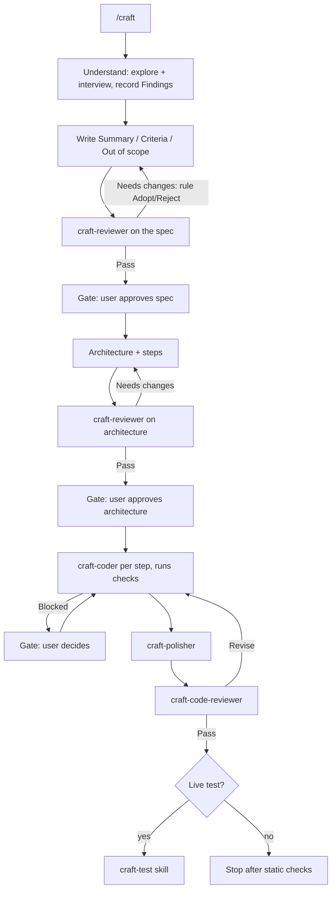

# craft

A Cursor plugin for building features the right way.

AI agents are great at producing code that *works* and bad at producing code that is clean, modular, readable, and idiomatic. `craft` fixes that by making the main agent the **planner**: it owns understanding, the spec, the architecture, and the plan, while focused subagents explore, review, implement, polish, and live-test. Each agent carries the standards verbatim in its own file; the orchestrator owns every gate and proves the finished feature by running it locally.

The `/craft` workflow is one elastic path: explore and interview, write a spec (Summary / Criteria / Out of scope) and get it reviewed then approved, design the architecture and steps and get those reviewed then approved, implement hands-off, polish, run a fresh-context code review over the full diff, and offer to live-test. The user approves two documents — the spec, then the architecture. A blocked coder comes back as a third gate.

Every run asks before live-testing at the end; say no and it stops after the static checks.

## What's inside

| Component | Type | Role |
|---|---|---|
| `craft` | skill (`/craft`) | Writes spec then architecture with a review and a user gate on each, then implements hands-off |
| `craft-auto` | skill (`/craft-auto`) | Interviews once, then runs to the goal unattended — every design critiqued before it is built, capped review loops, live proof and a commit per slice |
| `craft-design` | skill (`/craft-design`) | Mocks 3–5 UI directions in one Canvas, iterates to a chosen design, then implements the UI |
| `craft-test` | skill (`/craft-test`) | Proves a feature works by running it live; standalone or as craft's final step |
| `craft-monitor` | skill (`/craft-monitor`) | Checks a shipped feature against live production data; reports problems and improvements worth considering |
| `craft-research` | skill (`/craft-research`) | Breaks a topic into areas, researches each in parallel, and produces a refined doc in `Docs/` |
| `craft-refactor` | skill (`/craft-refactor`) | Recovers a behavior spec from existing code, generates a clean design from that spec, critic-loops it, then refactors without changing observable behavior |
| `craft-coder` | subagent | Implements one focused assignment into the repo |
| `craft-critic` | subagent (readonly) | Adversarial design critic — searches for a better design; proposes one or shows why the draft holds. Better design / Holds |
| `craft-code-reviewer` | subagent (readonly) | Fresh-context review of an implementation — Pass / Revise |
| `craft-polisher` | subagent | Restructures and polishes a working diff without changing observable behavior |
| `craft-tester` | subagent | Runs a feature live — verification, local process, real requests, screenshots — and returns per-criterion evidence |
| `craft-reviewer` | subagent (readonly) | Gates a spec or architecture before it is built — Better design / Needs changes / Pass |
| `craft-researcher` | subagent (readonly) | Deep web research — finds and fully reads authoritative sources, returns synthesized findings |

Each agent carries the standards verbatim; shared references (spec, architecture, plan template) live under `skills/craft/references/`.

## The workflow



### Artifacts it produces (in the target repo)

- `docs/plans/<feature>.md` — the board. Spec (Summary / Criteria / Out of scope), Findings, Architecture, Steps, Rulings, then progress through build, review, and live proof.
- `docs/monitor/<feature>.md` — written by `craft-monitor`. How the feature works, how to reach its data, four to six checks as literal queries with their observed normal ranges, and the running log of findings.

## Install

### Marketplace (recommended)

Open the Marketplace panel in Cursor, search for **craft**, and install — choosing project or user scope. Nothing else to set up.

> Not yet published. Until it's live on the [Cursor Marketplace](https://cursor.com/marketplace), use the local install below.

### Local (development)

A plugin loads when it lives under `~/.cursor/plugins/local/` with its `.cursor-plugin/plugin.json` at the root. Clone it straight into place:

```bash
git clone git@github.com:AidenHadisi/craft.git ~/.cursor/plugins/local/craft
```

Or, if you keep your working copy elsewhere, symlink the repo **into** the plugins folder (this is the supported direction — link your repo *in*, not the other way around):

```bash
ln -s /path/to/your/craft ~/.cursor/plugins/local/craft
```

Then run **Developer: Reload Window** from the Command Palette. Confirm `/craft` appears in Settings → Rules and that the `craft-*` subagents are available.

## Publishing

Cursor plugins are distributed as public Git repositories reviewed by the Cursor team — there's no publish CLI. To release a new version:

1. Bump `version` in `.cursor-plugin/plugin.json` (semver).
2. Commit a logo to `assets/` and add `"logo": "assets/<file>.svg"` to the manifest (relative paths resolve against the repo on GitHub).
3. Push to the public repo, then submit the repo URL at [cursor.com/marketplace/publish](https://cursor.com/marketplace/publish).

Components are auto-discovered from their default folders (`skills/`, `agents/`, `rules/`, `commands/`, `hooks/`), so the manifest only needs metadata — no path wiring required.

## Usage

```
/craft add OAuth login for the dashboard
```

You approve two documents. First the spec — what and why, never how — after `craft-reviewer` tries to beat it. Then the architecture and its steps, after another review. A major redesign comes back to you before settled pieces are rewritten. After you approve the architecture, implementation is hands-off: the coder runs the repo's check commands; a blocked slice comes back as a gate. When every step is done, polish and `craft-code-reviewer` run over the full diff, and it asks before live-testing — decline and it stops there.

Every `craft-*` agent is usable on its own, not only from a skill.

To hand over a goal and get back a finished, proven feature:

```
/craft-auto add OAuth login for the dashboard
```

It interviews you once and ends that interview with criteria, each paired with the live check that will prove it. From there it runs unattended. Every design — the architecture and then each slice — goes to `craft-critic`, which searches for a better design and either proposes one or shows why the draft holds; the orchestrator rules on each objection in the plan's Rulings. Each slice is then coded (checks included), reviewed under a capped fix loop, **run live** against the local environment, and committed. Finish is a whole-branch review and polish, then the full `craft-test` flow against every criterion — never a question. A `Saw:` line that does not show the criterion is a failed proof. It stops to ask only when a loop cannot converge, the coder is blocked, or the local environment cannot be reached.

For UI work, compare 3–5 mock directions in one Canvas, refine or combine them, then implement the one you pick:

```
/craft-design redesign the analytics dashboard
```

To clean up existing code rather than build something new, hand it a target and let it work:

```
/craft-refactor the payment reconciliation package
```

No interview — it explores the target, recovers a mostly non-technical spec of how the thing should work, and designs a simple modern solution from that spec. `craft-critic` loops that design until it holds (or hits the cap). Then it presents one recommendation as a single go/no-go gate. On approval, it refactors in small verified waves — observable behavior, public APIs, and wire shapes preserved — with `craft-code-reviewer` on the diff and `craft-polisher` finishing. If there is no narrow boundary, it steers the existing code toward the sketch instead of replacing it.

Once it ships, check on it. Standalone — invoke it whenever you want to know how something is behaving, whether craft built it or not:

```
/craft-monitor site-evaluation
```

The first invocation learns the feature — its tables, log streams, metrics, and the exact way to query each — and writes `docs/monitor/<feature>.md` with four to six checks. Run in the session that just built the feature, it reuses what's already in context and researches only the gaps. Either way every check is **run before it's written down**, so the recorded normal range is an observed value rather than a guessed threshold.

Every invocation after that follows the file: work the checks, compare each against its normal range and the log, then look around for what the checks don't cover. What comes back is problems and observations alike — a step eating the runtime or output that's weak for one kind of input is worth knowing even though nothing is broken. Most runs report nothing new, and that's the point: the bar is whether a person would want to know, not whether the agent found something to say.

## Design notes

- **Orchestrator owns architecture.** Spec, design, and plan stay in one context so decisions don't die in a handoff.
- **Delegation for labor.** Exploration, research, coding, review, and live testing use subagents; judgment stays with the orchestrator, and so does its context.
- **Standards in every agent.** Each agent carries the spec and design standards verbatim; shared references live under `skills/craft/references/`.
- **Critique, not consensus.** `/craft-auto`'s critic searches for a challenger design and either proposes a better one or shows why the draft holds; the orchestrator rules in writing, and rulings are settled.
- **Diffs, not reports.** Coder reports are claims; `craft-code-reviewer` owns the Pass/Revise gate over the full diff — the orchestrator accepts findings, loops coders, and advances only on Pass.
- **Prove it runs.** Every run ends with static checks, then live testing — run locally under a test account, real data where it is safe, stop before anything leaves the system, revert every temporary change.
- **Readonly where it counts.** Exploration, research, and review agents are readonly; they inform the orchestrator but never edit artifacts.

## License

MIT — see [LICENSE](LICENSE).
