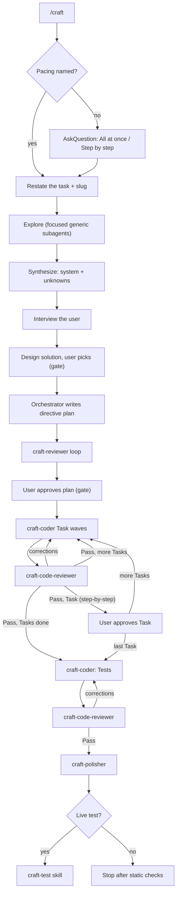

# craft

A Cursor plugin for building features the right way.

AI agents are great at producing code that *works* and bad at producing code that is clean, modular, readable, and idiomatic. `craft` fixes that by making the main agent an **autonomous senior developer**: it plans, directs, and judges, while fast parallel subagents do the labor — exploring, coding, reviewing. Every wave of coder output is reviewed by a fresh-context code reviewer; the orchestrator owns the gate (accept findings, loop coders, advance only on Pass), and the finished feature is proven by running it locally, not just reading it.

One skill, one workflow — it asks whether to implement all Tasks at once or one at a time unless you name the pacing:

- **All at once (default)** — explore, interview the user on open decisions, present design options, write a directive-level plan, review it, get approval, implement with parallel coders under fresh-context code review (orchestrator gates each wave), polish, then offer to live-test. Two approval gates: design choice, plan.
- **Step by step** — same workflow, but one Task at a time with a user approval gate after each implemented Task. Polish and the live-test offer still run once at the end.

Every run asks before live-testing at the end; say no and it stops after the static checks.

## What's inside

| Component | Type | Role |
|---|---|---|
| `craft` | skill (`/craft`) | Orchestrates the workflow; asks all-at-once vs step-by-step unless pacing is named, directs subagents, gates each code-review wave, live-tests the result |
| `craft-test` | skill (`/craft-test`) | Proves a feature works by running it live; standalone or as craft's final step |
| `craft-monitor` | skill (`/craft-monitor`) | Checks a shipped feature against live production data; reports problems and improvements worth considering |
| `craft-research` | skill (`/craft-research`) | Researches a topic across many sources and produces a refined doc in `Docs/` |
| `craft-coder` | subagent | Implements one Task from a directive plan, following repo idioms |
| `craft-code-reviewer` | subagent (readonly) | Fresh-context review of each implementation wave — Pass / Revise with line-cited findings |
| `craft-polisher` | subagent | Architect pass over the working diff — restructures and polishes to the shared standards |
| `craft-reviewer` | subagent (readonly) | Gates a directive plan — verdict plus itemized fixes |

Shared coding, design, and testing guidance lives at the plugin root under `standards/` — infrastructure used by the orchestrator and subagents, not private to the craft skill. The skill keeps its own example plan:

| Reference | Used by | Covers |
|---|---|---|
| `standards/constitution.md` | coder, code reviewer, polisher, reviewer, orchestrator | Hard write-time constraints + anti-verbosity diff rubric |
| `standards/principles.md` | orchestrator, reviewer, code reviewer, polisher | Architecture, code design, and refactoring judgment |
| `standards/testing.md` | orchestrator, reviewer, coder (Tests); code reviewer when tests changed | Test what matters, repo idioms, mocking only at boundaries |
| `skills/craft/references/example-plan.md` | orchestrator | A worked example directive-level plan |

## The workflow



### Artifacts it produces (in the target repo)

- `docs/plans/<feature>.md` — the implementation plan. Directive-level (where and what, contracts where precision matters), written by the orchestrator.
- `docs/monitor/<feature>.md` — written by `craft-monitor`. How the feature works, how to reach its data, four to six checks as literal queries with their observed normal ranges, and the running log of findings.

## Install

### Marketplace (recommended)

Open the Marketplace panel in Cursor, search for **craft**, and install — choosing project or user scope. Nothing else to set up.

> Not yet published. Until it's live on the [Cursor Marketplace](https://cursor.com/marketplace), use the local install below.

### Local (development)

A plugin loads when it lives under `~/.cursor/plugins/local/` with its `.cursor-plugin/plugin.json` at the root. Clone it straight into place:

```bash
git clone git@github.com:AidenHadisi/craft.git ~/.cursor/plugins/local/craft
```

Or, if you keep your working copy elsewhere, symlink the repo **into** the plugins folder (this is the supported direction — link your repo *in*, not the other way around):

```bash
ln -s /path/to/your/craft ~/.cursor/plugins/local/craft
```

Then run **Developer: Reload Window** from the Command Palette. Confirm `/craft` appears in Settings → Rules and that the `craft-*` subagents are available.

## Publishing

Cursor plugins are distributed as public Git repositories reviewed by the Cursor team — there's no publish CLI. To release a new version:

1. Bump `version` in `.cursor-plugin/plugin.json` (semver).
2. Commit a logo to `assets/` and add `"logo": "assets/<file>.svg"` to the manifest (relative paths resolve against the repo on GitHub).
3. Push to the public repo, then submit the repo URL at [cursor.com/marketplace/publish](https://cursor.com/marketplace/publish).

Components are auto-discovered from their default folders (`skills/`, `agents/`, `rules/`, `commands/`, `hooks/`), so the manifest only needs metadata — no path wiring required.

## Usage

When no pacing is named, the skill asks whether to implement all Tasks at once or one at a time. Name one to skip the question:

```
/craft add OAuth login for the dashboard
/craft step by step — add OAuth login for the dashboard
```

Two approvals always (the design choice and the plan); the plan is reviewed by `craft-reviewer` before that gate. Step-by-step adds a per-Task approval during implementation. Each implementation wave is reviewed by `craft-code-reviewer` (orchestrator owns the gate), then static checks run, and it asks before live-testing — decline and it stops there.

Once it ships, check on it. Standalone — invoke it whenever you want to know how something is behaving, whether craft built it or not:

```
/craft-monitor site-evaluation
```

The first invocation learns the feature — its tables, log streams, metrics, and the exact way to query each — and writes `docs/monitor/<feature>.md` with four to six checks. Run in the session that just built the feature, it reuses what's already in context and researches only the gaps. Either way every check is **run before it's written down**, so the recorded normal range is an observed value rather than a guessed threshold.

Every invocation after that follows the file: work the checks, compare each against its normal range and the log, then look around for what the checks don't cover. What comes back is problems and observations alike — a step eating the runtime or output that's weak for one kind of input is worth knowing even though nothing is broken. Most runs report nothing new, and that's the point: the bar is whether a person would want to know, not whether the agent found something to say.

## Design notes

- **Delegation-first.** The orchestrator's context is spent on judgment, not labor. Craft subagents inherit the orchestrator's model; model choice for generic dispatches follows the workspace's subagent model-selection rule.
- **Self-contained skill.** The full workflow lives in `SKILL.md` and reads top to bottom. Shared standards (constitution, principles, testing) live at the plugin root; the skill's example plan stays under `skills/craft/references/`.
- **Diffs, not reports.** Coder reports are claims; `craft-code-reviewer` reviews each wave in a fresh context, and the orchestrator owns the gate — accepts findings, loops coders, advances only on Pass.
- **Prove it runs.** Every run ends with static checks, then offers live testing — run locally with real credentials, stub side effects, never mutate prod, revert every temporary change.
- **Readonly where it counts.** Exploration subagents and reviewers are readonly; they inform the orchestrator but never edit artifacts.

## License

MIT — see [LICENSE](LICENSE).
