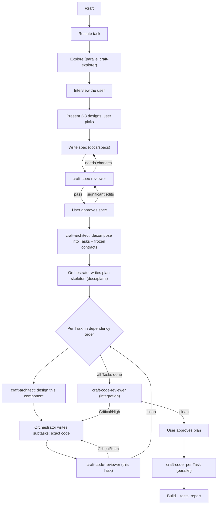

# craft

A Cursor plugin for building features the right way.

AI agents are great at producing code that *works* and bad at producing code that is clean, modular, readable, and idiomatic. `craft` fixes that by separating thinking from typing: it gathers context, aligns with you, chooses a design, writes a non-technical spec, architects a clean solution, writes the full implementation code up front, reviews it — and only then implements, in parallel, exactly as planned.

The quality levers are the dedicated **architect** and two **review gates** (one for the spec, one for the code), so problems get caught on paper where they're cheap to fix.

## What's inside

Two orchestrator skills. `craft` looks forward — it designs and builds a new feature by writing the spec and plan itself and dispatching five specialized subagents. `craft-rearchitect` looks backward — it audits code that already exists and reports how to improve its architecture, reusing the explorer for parallel discovery.

| Component | Type | Role |
|---|---|---|
| `craft` | skill (`/craft`) | Orchestrates the build pipeline; writes the spec and the plan |
| `craft-rearchitect` | skill (`/craft-rearchitect`) | Audits existing code; reports findings + a refactoring roadmap (no docs, no code changes) |
| `craft-explorer` | subagent (readonly) | Gathers logic + conventions, in parallel |
| `craft-spec-reviewer` | subagent (readonly) | Gates the spec for clarity & completeness |
| `craft-architect` | subagent (readonly) | Decomposes the system, then designs each component |
| `craft-code-reviewer` | subagent (readonly) | Reviews the planned code before it ships |
| `craft-coder` | subagent | Implements the plan verbatim, in parallel |

## The workflow



### Artifacts it produces (in the target repo)

- `docs/specs/<feature>.md` — the spec: idea and requirements, readable by engineers and product managers alike. No code.
- `docs/plans/<feature>.md` — the implementation plan: a decomposition (architecture, boundaries, frozen contracts) plus ordered Tasks, each broken into subtasks carrying complete literal code or a manual action. The orchestrator decides at dispatch time which Tasks can be coded in parallel.

## Install

### Local (development)

The plugin must live as a **real directory** inside Cursor's local plugin folder. Recent Cursor builds reject a symlink whose target points outside `~/.cursor/plugins/local/` (`loadUserLocalPlugin ... rejected: symlink target ... is outside`), so clone or move the repo directly into place:

```bash
git clone git@github.com:AidenHadisi/craft.git ~/.cursor/plugins/local/craft
```

If you keep your working copy elsewhere, put the real repo under `~/.cursor/plugins/local/craft` and symlink *back* to your preferred location (a symlink that points into the plugins dir is fine; one that points out of it is not):

```bash
ln -s ~/.cursor/plugins/local/craft ~/your/workspace/craft
```

Then open the Command Palette → "Reload Window". Confirm `/craft` and `/craft-rearchitect` appear in Settings → Rules and that the `craft-*` subagents are available.

### Marketplace / git

Point Cursor at the repository once it's published, or add it via your plugin marketplace configuration.

## Usage

In any project, start a feature with:

```
/craft add OAuth login for the dashboard
```

Then follow the phases — answer the interview, pick a design, approve the spec, approve the plan. The agent handles the rest, including dispatching the coders in parallel.

You can also invoke any subagent directly when you want just that step, e.g. `/craft-architect` on an existing spec.

### Auditing existing code

When the code already exists and you want to know how to improve its design, use the backward-looking skill instead:

```
/craft-rearchitect the order checkout flow
```

It explores the target with parallel `craft-explorer` subagents, evaluates the current design against the same principles `craft` builds with (deep modules, cohesion/coupling, the complexity budget in both directions, modern/idiomatic usage), and delivers a comprehensive report right in the chat: a verdict, an architecture map, severity-ranked findings, a target design, and an ordered refactoring roadmap. It is analysis-only — it writes no `docs/` artifacts and changes no code. When you want to act on a roadmap item, hand it to `/craft`.

## Design notes

- **Single-writer rule.** The orchestrator writes both the spec and the plan (including the plan's code); only `craft-coder` writes real source. Handoffs are file-based, which keeps context cheap and avoids write conflicts.
- **Readonly where it counts.** Explorers and all reviewers are readonly, so they can't drift into making changes.
- **Concise on purpose.** Each subagent doc is kept tight — verbose instructions degrade model performance.

## License

MIT — see [LICENSE](LICENSE).
