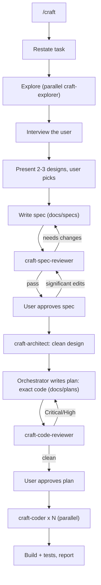

# craft

A Cursor plugin for building features the right way.

AI agents are great at producing code that *works* and bad at producing code that is clean, modular, readable, and idiomatic. `craft` fixes that by separating thinking from typing: it gathers context, aligns with you, chooses a design, writes a non-technical spec, architects a clean solution, writes the full implementation code up front, reviews it — and only then implements, in parallel, exactly as planned.

The quality levers are the dedicated **architect** and two **review gates** (one for the spec, one for the code), so problems get caught on paper where they're cheap to fix.

## What's inside

One orchestrator skill that drives the workflow by writing the spec and plan itself and dispatching five specialized subagents.

| Component | Type | Role |
|---|---|---|
| `craft` | skill (`/craft`) | Orchestrates the pipeline; writes the spec and the plan |
| `craft-explorer` | subagent (readonly) | Gathers logic + conventions, in parallel |
| `craft-spec-reviewer` | subagent (readonly) | Gates the spec for clarity & completeness |
| `craft-architect` | subagent (readonly) | Designs a clean, modular, idiomatic solution |
| `craft-code-reviewer` | subagent (readonly) | Reviews the planned code before it ships |
| `craft-coder` | subagent | Implements the plan verbatim, in parallel |

## The workflow



### Artifacts it produces (in the target repo)

- `docs/specs/<feature>.md` — the spec: idea and requirements, readable by engineers and product managers alike. No code.
- `docs/plans/<feature>.md` — the implementation plan: ordered steps with complete literal code and file-ownership groups for parallel implementation.

## Install

### Local (development)

Symlink or copy this repo into Cursor's local plugin directory, then reload the window:

```bash
ln -s "$PWD" ~/.cursor/plugins/local/craft
```

In Cursor: open the Command Palette → "Reload Window". Confirm `/craft` and the `/craft-*` subagents appear.

### Marketplace / git

Point Cursor at the repository once it's published, or add it via your plugin marketplace configuration.

## Usage

In any project, start a feature with:

```
/craft add OAuth login for the dashboard
```

Then follow the phases — answer the interview, pick a design, approve the spec, approve the plan. The agent handles the rest, including dispatching the coders in parallel.

You can also invoke any subagent directly when you want just that step, e.g. `/craft-architect` on an existing spec.

## Design notes

- **Single-writer rule.** The orchestrator writes both the spec and the plan (including the plan's code); only `craft-coder` writes real source. Handoffs are file-based, which keeps context cheap and avoids write conflicts.
- **Readonly where it counts.** Explorers and all reviewers are readonly, so they can't drift into making changes.
- **Concise on purpose.** Each subagent doc is kept tight — verbose instructions degrade model performance.

## License

MIT — see [LICENSE](LICENSE).
