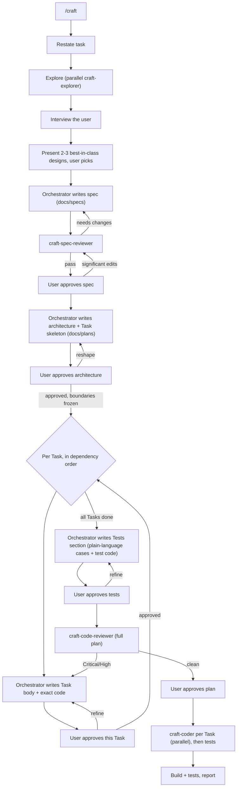

# craft

A Cursor plugin for building features the right way.

AI agents are great at producing code that *works* and bad at producing code that is clean, modular, readable, and idiomatic. `craft` fixes that by separating thinking from typing: it gathers context, aligns with you, weighs multiple approaches and picks the strongest, writes a non-technical spec, decomposes the system into components, designs each one down to the code up front, reviews it — and only then implements, in parallel, exactly as planned.

The bar throughout is the **best** solution — sound design and established best practices, not the first thing that works. Quality levers: a design-options step, a two-altitude design pass (system-level architecture fixes boundaries → per-component design fills in contracts and code), reference files carrying proven principles, and user-approval gates at the spec, the architecture, every component, and the tests — so problems get caught on paper where they're cheap to fix.

## What's inside

| Component | Type | Role |
|---|---|---|
| `craft` | skill (`/craft`) | Orchestrates the build pipeline; writes the spec and plan, gates every step |
| `craft-explorer` | subagent (readonly) | Gathers logic + conventions, in parallel |
| `craft-spec-reviewer` | subagent (readonly) | Gates the spec for clarity & completeness |
| `craft-code-reviewer` | subagent (readonly) | Reviews the planned code before it ships |
| `craft-coder` | subagent | Implements the plan verbatim, in parallel |

Three reference files guide the orchestrator's design work:

| Reference | Used in | Covers |
|---|---|---|
| `references/architecture-principles.md` | Phase 7 (decompose) | Where to cut boundaries, dependency rules, choosing an architectural style, complexity budget, plan template, self-critique |
| `references/design-principles.md` | Phase 9 (per-Task design) | "Less code is better" + the don't-list, function shape, naming, errors, state, when patterns are justified, Task body template, self-critique |
| `references/testing-principles.md` | Phase 10 (design tests) | Test what matters (and skip what's trivially correct), repo idioms, mocking only at boundaries, plain-language case lists, Tests section template, self-critique |

## The workflow



### Artifacts it produces (in the target repo)

- `docs/specs/<feature>.md` — the spec: idea and requirements, readable by engineers and product managers alike. No code.
- `docs/plans/<feature>.md` — the implementation plan. The orchestrator writes it start to finish: the architecture (components, conceptual boundaries, seams between Tasks), each Task's body (the concrete contract plus complete literal code or a manual action), and a closing Tests section — plain-language descriptions of what each test case verifies plus the literal test code, with explicit reasons for anything deliberately left untested. The orchestrator decides at dispatch time which Tasks can be coded in parallel.

## Install

### Marketplace (recommended)

Open the Marketplace panel in Cursor, search for **craft**, and install — choosing project or user scope. Nothing else to set up.

> Not yet published. Until it's live on the [Cursor Marketplace](https://cursor.com/marketplace), use the local install below.

### Local (development)

A plugin loads when it lives under `~/.cursor/plugins/local/` with its `.cursor-plugin/plugin.json` at the root. Clone it straight into place:

```bash
git clone git@github.com:AidenHadisi/craft.git ~/.cursor/plugins/local/craft
```

Or, if you keep your working copy elsewhere, symlink the repo **into** the plugins folder (this is the supported direction — link your repo *in*, not the other way around):

```bash
ln -s /path/to/your/craft ~/.cursor/plugins/local/craft
```

Then run **Developer: Reload Window** from the Command Palette. Confirm `/craft` appears in Settings → Rules and that the `craft-*` subagents are available.

## Publishing

Cursor plugins are distributed as public Git repositories reviewed by the Cursor team — there's no publish CLI. To release a new version:

1. Bump `version` in `.cursor-plugin/plugin.json` (semver).
2. Commit a logo to `assets/` and add `"logo": "assets/<file>.svg"` to the manifest (relative paths resolve against the repo on GitHub).
3. Push to the public repo, then submit the repo URL at [cursor.com/marketplace/publish](https://cursor.com/marketplace/publish).

Components are auto-discovered from their default folders (`skills/`, `agents/`, `rules/`, `commands/`, `hooks/`), so the manifest only needs metadata — no path wiring required.

## Usage

In any project, start a feature with:

```
/craft add OAuth login for the dashboard
```

Then follow the phases — answer the interview, pick a design, approve the spec, approve the architecture, then approve each Task as it's designed. The agent handles the rest, including dispatching the coders in parallel.

## Design notes

- **Reference-driven design.** The orchestrator reads `references/architecture-principles.md`, `references/design-principles.md`, and `references/testing-principles.md` at the right phases, so design knowledge lives in versionable, editable files — not baked into subagent prompts.
- **Single-writer rule.** The orchestrator authors both the spec and the plan; only `craft-coder` writes repo source. Reviewers are readonly.
- **Readonly where it counts.** Explorers and all reviewers are readonly; they inform the orchestrator but never edit artifacts.
- **Concise on purpose.** Each subagent doc is kept tight — verbose instructions degrade model performance.

## License

MIT — see [LICENSE](LICENSE).
