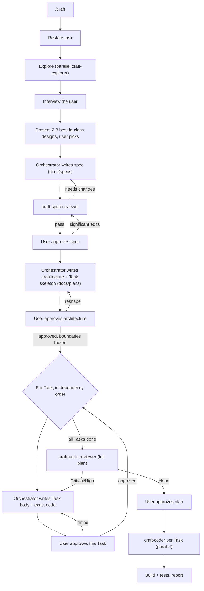

# craft

A Cursor plugin for building features the right way.

AI agents are great at producing code that *works* and bad at producing code that is clean, modular, readable, and idiomatic. `craft` fixes that by separating thinking from typing: it gathers context, aligns with you, weighs multiple approaches and picks the strongest, writes a non-technical spec, decomposes the system into components, designs each one down to the code up front, reviews it — and only then implements, in parallel, exactly as planned.

The bar throughout is the **best** solution — sound design and established best practices, not the first thing that works. Quality levers: a design-options step, a two-altitude design pass (system-level architecture fixes boundaries → per-component design fills in contracts and code), reference files carrying proven principles, and user-approval gates at the spec, the architecture, and every component — so problems get caught on paper where they're cheap to fix.

## What's inside

Two orchestrator skills. `craft` looks forward — it writes the spec and the plan, dispatches reviewers and coders, and gates every step. `craft-rearchitect` looks backward — it audits code that already exists and reports how to improve its architecture, reusing the explorer for parallel discovery.

| Component | Type | Role |
|---|---|---|
| `craft` | skill (`/craft`) | Orchestrates the build pipeline; writes the spec and plan, gates every step |
| `craft-rearchitect` | skill (`/craft-rearchitect`) | Audits existing code; reports findings + a refactoring roadmap (no docs, no code changes) |
| `craft-explorer` | subagent (readonly) | Gathers logic + conventions, in parallel |
| `craft-spec-reviewer` | subagent (readonly) | Gates the spec for clarity & completeness |
| `craft-code-reviewer` | subagent (readonly) | Reviews the planned code before it ships |
| `craft-coder` | subagent | Implements the plan verbatim, in parallel |

Two reference files guide the orchestrator's design work:

| Reference | Used in | Covers |
|---|---|---|
| `references/architecture-principles.md` | Phase 7 (decompose) | Boundaries, decomposition, dependency rules, complexity budget, plan template, self-critique |
| `references/design-principles.md` | Phase 9 (per-Task design) | "Less code is better," the don't-list, code principles, Task body template, self-critique |

## The workflow



### Artifacts it produces (in the target repo)

- `docs/specs/<feature>.md` — the spec: idea and requirements, readable by engineers and product managers alike. No code.
- `docs/plans/<feature>.md` — the implementation plan. The orchestrator writes it start to finish: the architecture (components, conceptual boundaries, seams between Tasks), then each Task's body (the concrete contract plus complete literal code or a manual action). The orchestrator decides at dispatch time which Tasks can be coded in parallel.

## Install

### Local (development)

The plugin must live as a **real directory** inside Cursor's local plugin folder. Recent Cursor builds reject a symlink whose target points outside `~/.cursor/plugins/local/` (`loadUserLocalPlugin ... rejected: symlink target ... is outside`), so clone or move the repo directly into place:

```bash
git clone git@github.com:AidenHadisi/craft.git ~/.cursor/plugins/local/craft
```

If you keep your working copy elsewhere, put the real repo under `~/.cursor/plugins/local/craft` and symlink *back* to your preferred location (a symlink that points into the plugins dir is fine; one that points out of it is not):

```bash
ln -s ~/.cursor/plugins/local/craft ~/your/workspace/craft
```

Then open the Command Palette → "Reload Window". Confirm `/craft` and `/craft-rearchitect` appear in Settings → Rules and that the `craft-*` subagents are available.

### Marketplace / git

Point Cursor at the repository once it's published, or add it via your plugin marketplace configuration.

## Usage

In any project, start a feature with:

```
/craft add OAuth login for the dashboard
```

Then follow the phases — answer the interview, pick a design, approve the spec, approve the architecture, then approve each Task as it's designed. The agent handles the rest, including dispatching the coders in parallel.

### Auditing existing code

When the code already exists and you want to know how to improve its design, use the backward-looking skill instead:

```
/craft-rearchitect the order checkout flow
```

It explores the target with parallel `craft-explorer` subagents, evaluates the current design against the same principles `craft` builds with (deep modules, cohesion/coupling, the complexity budget in both directions, modern/idiomatic usage), and delivers a comprehensive report right in the chat: a verdict, an architecture map, severity-ranked findings, a target design, and an ordered refactoring roadmap. It is analysis-only — it writes no `docs/` artifacts and changes no code. When you want to act on a roadmap item, hand it to `/craft`.

## Design notes

- **Reference-driven design.** The orchestrator reads `references/architecture-principles.md` and `references/design-principles.md` at the right phases, so design knowledge lives in versionable, editable files — not baked into subagent prompts.
- **Single-writer rule.** The orchestrator authors both the spec and the plan; only `craft-coder` writes repo source. Reviewers are readonly.
- **Readonly where it counts.** Explorers and all reviewers are readonly; they inform the orchestrator but never edit artifacts.
- **Concise on purpose.** Each subagent doc is kept tight — verbose instructions degrade model performance.

## License

MIT — see [LICENSE](LICENSE).
