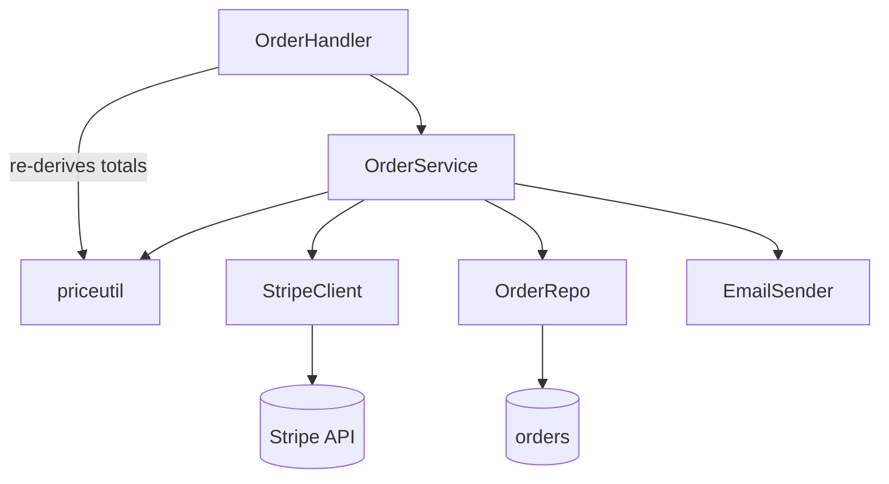

## Rearchitecture audit: order checkout

### Verdict
Checkout works in production but is carried by a single 900-line `OrderService` that owns pricing, tax, payment, inventory, and email — every change to any of those forces edits to the same file and re-tests the whole thing. The biggest structural risk is that file: it's a god object with no internal seams, so bugs in one concern (tax rounding) routinely ship alongside unrelated ones (email copy), and nothing here is unit-testable without a live Stripe key and a real database. This needs a focused refactor that carves the concerns into deep modules behind a thin orchestrator — not a ground-up redesign; the domain logic itself is sound and worth keeping.

### Current architecture
| Module | Path | Responsibility today | Health |
|---|---|---|---|
| `OrderService` | `internal/order/service.go` | Pricing, tax, payment, inventory, email, persistence — all of it | problem |
| `OrderHandler` | `internal/httpapi/orders.go` | HTTP decode + calls `OrderService.Checkout`, also re-validates totals | strained |
| `priceutil` | `internal/order/priceutil.go` | Hand-rolled money math on `float64` | problem |
| `StripeClient` | `internal/payment/stripe.go` | Thin wrapper over Stripe SDK | solid |
| `OrderRepo` | `internal/order/repo.go` | SQL for orders + line items | solid |

The back-edge from `OrderHandler` straight into `priceutil` (re-deriving totals to "double-check" the service) is the coupling that hurts most: pricing rules now live in two places.

### What works well
- `StripeClient` and `OrderRepo` are already deep modules — simple interfaces, real complexity hidden. Leave them alone; the refactor should reuse them as-is.
- The domain rules themselves (discount stacking order, tax-after-discount) are correct and well covered by the integration test in `service_test.go`. Preserve that behaviour exactly.

### Findings
- **[Critical] `internal/order/priceutil.go`** — money is `float64`, so totals drift on multi-item orders with percentage discounts (observed: off-by-one-cent on ~3% of carts). Impact: real revenue/refund discrepancies. Principle: maintainability / modern-idiomatic — money should be integer minor units or a decimal type.
- **[High] `internal/order/service.go`** — `OrderService.Checkout` is a 240-line method spanning five concerns with no seams. Impact: every concern change re-tests all of them; no concern is independently testable. Principle: one responsibility per module; deep modules. This is the god object.
- **[High] `internal/httpapi/orders.go`** — the handler re-derives order totals by calling `priceutil` directly to "verify" the service result. Impact: pricing logic is duplicated across two layers; the two already disagree on rounding. Principle: separation of concerns / DRY — pricing belongs to one owner.
- **[Medium] `internal/order/service.go`** — order state is passed around as separate `customerID`, `items`, `discountCode`, `addr1`, `addr2`, `city`, `zip` parameters (9-arg internal calls). Impact: signatures churn on every field change. Principle: primitive obsession / long parameter list — wants an `Order` value.
- **[Medium] `internal/order/service.go`** — payment errors are logged and swallowed, returning a generic `nil` order on failure. Impact: failed charges look like successes to the caller. Principle: maintainability — fail fast at the boundary.
- **[Low] `internal/order/service.go`** — email sending is inline in `Checkout`; a send failure blocks the order from completing. Principle: separation of concerns — notification is a side effect, not part of the transaction.

Note: the `OrderServiceFactory` + `OrderServiceConfig` builder (in `service.go`) looked like over-engineering, but it's the only seam the existing test uses to inject a fake Stripe client — it earns its place. Not a finding.

### Target design
Carve `OrderService.Checkout` into a thin orchestrator over four deep modules, each independently testable:

- **`pricing`** — owns all money math. Input: cart + discount; output: an itemized, rounded total in integer minor units. The single owner of pricing rules; the handler stops re-deriving anything. Interface: `Quote(cart, discount) (PricedOrder, error)`.
- **`checkout` (orchestrator)** — sequences quote → reserve inventory → charge → persist → enqueue email. Holds no domain rules itself; it wires the steps and owns the transaction boundary. Interface unchanged: `Checkout(ctx, Order) (Confirmation, error)` so the handler doesn't move.
- **`payment`** — keep `StripeClient`, but charge failures now propagate as typed errors the orchestrator maps to a status; no swallowing.
- **notification** — email moves behind an enqueue call so a send failure can't fail a paid order.

An `Order` value object replaces the loose primitives, killing the long parameter lists. Boundaries become one-way: `httpapi → checkout → {pricing, payment, inventory, repo, notification}`, with no layer reaching past the orchestrator.

### Refactoring roadmap
- **Step 1 — Move money to integer minor units** (effort: M · risk: med). Replace `float64` in `priceutil` with `int64` cents (or a decimal lib). Closes the Critical rounding finding; unblocks a trustworthy `pricing` module. Do this first — everything downstream depends on correct totals.
- **Step 2 — Extract `pricing.Quote`** (effort: M · risk: low). Pull all money math out of `OrderService` and the handler into one module. Closes the duplicate-pricing High; the handler now consumes a quote instead of re-deriving one.
- **Step 3 — Introduce the `Order` value object** (effort: S · risk: low). Collapse the loose primitives into one struct. Closes the primitive-obsession Medium; shrinks every internal signature.
- **Step 4 — Reduce `OrderService` to an orchestrator** (effort: L · risk: med). With pricing extracted, sequence the remaining steps and propagate payment errors instead of swallowing them. Closes the god-object High and the swallowed-error Medium.
- **Step 5 — Move email behind an enqueue** (effort: S · risk: low). Closes the Low; a notification failure no longer rolls back a paid order.

### Notes
- Steps 1-2 deliver most of the value (correct money + single pricing owner) and are low/medium risk — worth shipping as their own PR before the larger Step 4.
- Whether money becomes `int64` cents or a `decimal` type is a valid either-way call; cents is simpler and matches the repo's existing `priceutil` rounding, decimal is friendlier if multi-currency is coming. The spec for this audit listed no multi-currency plans, so cents is the lighter choice.
- Inventory reservation was out of scope for this audit; it's touched by the orchestrator in Step 4 but its internals weren't reviewed.
