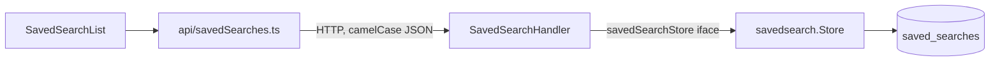

# Implementation Plan: Saved searches

> Spec: [docs/specs/saved-searches.md](docs/specs/saved-searches.md)

## Architecture & design

### Overview
A thin vertical slice across three layers — persistence, HTTP, frontend — added with no new infrastructure. Persistence is isolated behind a `Store` so the HTTP layer depends on a local interface, not on pgx. The saved query is stored as a `jsonb` blob so it survives URL-format changes. The shape matches the repo's existing store + handler convention, so nothing new has to be learned to read it.

### Module map
| Module | Path | Responsibility | Public interface | Hides | Status |
|---|---|---|---|---|---|
| `savedsearch.Store` | `internal/savedsearch/store.go` | All SQL for saved searches | `List(ctx, userID)`, `Upsert(ctx, userID, name, query)`, `Delete(ctx, userID, id)` | SQL text, pgx, upsert mechanics | new |
| `SavedSearchHandler` | `internal/httpapi/saved_searches.go` | HTTP: auth scoping, validation, DTO mapping | `List/Save/Delete(w, r)` | wire format, status codes, trimming | new |
| `savedSearches` API | `web/src/api/savedSearches.ts` | Typed fetch wrappers | `listSavedSearches/saveSearch/deleteSavedSearch` | fetch, credentials, URLs | new |
| `SavedSearchList` | `web/src/components/SavedSearchList.tsx` | Render list, run on click, delete | `<SavedSearchList onRun={...} />` | load + local list state | new |

### Boundaries & data flow
Dependency direction is one-way: `httpapi → savedsearch → db`. The `savedsearch` package never imports HTTP types; the handler talks to a local `savedSearchStore` interface that `*savedsearch.Store` satisfies. On the frontend the component never calls `fetch` directly — only the API module does.



### Data model
`saved_searches(id, user_id, name, query jsonb, created_at, updated_at)`.
Invariant: at most one row per `(user_id, name)`, enforced by a unique index and relied on by `Upsert`'s `ON CONFLICT`. `user_id` scopes every row to its owner; the query payload is opaque `jsonb` owned by the frontend's search model.

### Key interfaces / contracts
`savedSearchStore` is defined in `httpapi` and satisfied by `*savedsearch.Store`:
- `List(ctx, userID) ([]SavedSearch, error)` — returns that user's searches, newest first.
- `Upsert(ctx, userID, name, query) (SavedSearch, error)` — creates, or replaces the query for an existing `(userID, name)`. Postcondition: exactly one row for that pair.
- `Delete(ctx, userID, id) error` — removes the row only if it belongs to `userID`; deleting someone else's row is a no-op, not an error.

This interface is the seam tests attach to.

### Libraries
- `pgx/v5` for Postgres access — already the repo's DB driver; no new dependency. Standard-library `net/http` and `encoding/json` cover routing and serialization, so no framework is added.

### Cross-cutting concerns
- **Authz:** `userID` comes from request context; every store call is scoped by it, and `Delete` filters on `user_id` so cross-user deletes affect zero rows.
- **Validation:** names are trimmed and required at the HTTP boundary — empty/whitespace returns 400 before any DB call.
- **Errors:** the store returns raw errors; the handler maps them to a status code plus a safe message and never leaks SQL detail to the client.

### Complexity budget
This is deliberately the simplest design that satisfies the spec:
- **No service/use-case layer** between handler and store — the logic is thin (validate, scope, persist), so a third layer would be a shallow pass-through. Rejected.
- **No Strategy/registry for filter types** — the query is one opaque `jsonb` blob, so the backend needs no knowledge of filter shapes. Rejected normalized per-filter columns (would force a migration on every new filter, buying nothing here).
- **No generic `Repository[T]` abstraction** — one concrete store with three methods is clearer than a generic nobody else reuses yet.

### Change scenarios
- **New filter types in search:** absorbed for free — they ride inside the `jsonb` query; no backend change.
- **"Most recently used" ordering instead of newest-first:** isolated to `Store.List`'s `ORDER BY` plus a touch of `updated_at`; the interface and handler are untouched.

### Design decisions
- **Upsert on `(user_id, name)`** over read-then-write: one statement, race-free, and it satisfies "duplicate name updates existing" in the database rather than the app. Rejected app-level check-then-insert (TOCTOU race).
- **`jsonb` query blob** over normalized filter columns: query shape can evolve without migrations. Trade-off accepted: individual filters aren't indexable, which the spec's scale (tens per user) doesn't need.
- **Store interface defined in `httpapi`**, not exported from `savedsearch`: the consumer owns the abstraction it needs, keeping `savedsearch` free of HTTP-driven shapes.

### Refactoring notes
None — this feature is greenfield (all files are new), so there is no existing code to refactor first.

### Test seams
- Handler tested against a fake `savedSearchStore`: validation (empty name → 400), status codes, and that every call is scoped by the context `userID`.
- Store tested against a test database: upsert-on-name replaces rather than duplicates, and `List` returns newest-first.

## Steps

### Step 1 — Create the `saved_searches` table

Run this migration before deploying the backend. It creates the table and the unique index that the upsert relies on.

```sql
CREATE TABLE saved_searches (
    id          BIGSERIAL PRIMARY KEY,
    user_id     BIGINT      NOT NULL,
    name        TEXT        NOT NULL,
    query       JSONB       NOT NULL,
    created_at  TIMESTAMPTZ NOT NULL DEFAULT now(),
    updated_at  TIMESTAMPTZ NOT NULL DEFAULT now()
);

CREATE UNIQUE INDEX saved_searches_user_name_idx
    ON saved_searches (user_id, name);
```

### Step 2 — Store layer
[internal/savedsearch/store.go](internal/savedsearch/store.go) · create

Owns all SQL. `Upsert` implements save/rename-by-name in one statement; `List` returns newest first; `Delete` is scoped by `userID` so a user can never delete another user's row.

```go
package savedsearch

import (
	"context"
	"encoding/json"
	"time"

	"github.com/jackc/pgx/v5/pgxpool"
)

type SavedSearch struct {
	ID        int64           `json:"id"`
	UserID    int64           `json:"userId"`
	Name      string          `json:"name"`
	Query     json.RawMessage `json:"query"`
	CreatedAt time.Time       `json:"createdAt"`
	UpdatedAt time.Time       `json:"updatedAt"`
}

type Store struct {
	db *pgxpool.Pool
}

func NewStore(db *pgxpool.Pool) *Store {
	return &Store{db: db}
}

func (s *Store) List(ctx context.Context, userID int64) ([]SavedSearch, error) {
	rows, err := s.db.Query(ctx, `
		SELECT id, user_id, name, query, created_at, updated_at
		FROM saved_searches
		WHERE user_id = $1
		ORDER BY created_at DESC`, userID)
	if err != nil {
		return nil, err
	}
	defer rows.Close()

	var out []SavedSearch
	for rows.Next() {
		var ss SavedSearch
		if err := rows.Scan(&ss.ID, &ss.UserID, &ss.Name, &ss.Query, &ss.CreatedAt, &ss.UpdatedAt); err != nil {
			return nil, err
		}
		out = append(out, ss)
	}
	return out, rows.Err()
}

func (s *Store) Upsert(ctx context.Context, userID int64, name string, query json.RawMessage) (SavedSearch, error) {
	var ss SavedSearch
	err := s.db.QueryRow(ctx, `
		INSERT INTO saved_searches (user_id, name, query)
		VALUES ($1, $2, $3)
		ON CONFLICT (user_id, name)
		DO UPDATE SET query = EXCLUDED.query, updated_at = now()
		RETURNING id, user_id, name, query, created_at, updated_at`,
		userID, name, query,
	).Scan(&ss.ID, &ss.UserID, &ss.Name, &ss.Query, &ss.CreatedAt, &ss.UpdatedAt)
	return ss, err
}

func (s *Store) Delete(ctx context.Context, userID, id int64) error {
	_, err := s.db.Exec(ctx, `
		DELETE FROM saved_searches
		WHERE id = $1 AND user_id = $2`, id, userID)
	return err
}
```

### Step 3 — HTTP handler
[internal/httpapi/saved_searches.go](internal/httpapi/saved_searches.go) · create

Validates input, scopes every call to the authenticated user, and maps store rows to camelCase JSON. Depends on the store via an interface so it's unit-testable. Empty/whitespace names are rejected with 400.

```go
package httpapi

import (
	"context"
	"encoding/json"
	"net/http"
	"strconv"
	"strings"

	"example.com/app/internal/savedsearch"
)

type savedSearchStore interface {
	List(ctx context.Context, userID int64) ([]savedsearch.SavedSearch, error)
	Upsert(ctx context.Context, userID int64, name string, query json.RawMessage) (savedsearch.SavedSearch, error)
	Delete(ctx context.Context, userID, id int64) error
}

type SavedSearchHandler struct {
	store savedSearchStore
}

func NewSavedSearchHandler(store savedSearchStore) *SavedSearchHandler {
	return &SavedSearchHandler{store: store}
}

type saveSearchRequest struct {
	Name  string          `json:"name"`
	Query json.RawMessage `json:"query"`
}

func (h *SavedSearchHandler) List(w http.ResponseWriter, r *http.Request) {
	userID := userIDFromContext(r.Context())
	items, err := h.store.List(r.Context(), userID)
	if err != nil {
		writeError(w, http.StatusInternalServerError, "could not load saved searches")
		return
	}
	writeJSON(w, http.StatusOK, items)
}

func (h *SavedSearchHandler) Save(w http.ResponseWriter, r *http.Request) {
	var req saveSearchRequest
	if err := json.NewDecoder(r.Body).Decode(&req); err != nil {
		writeError(w, http.StatusBadRequest, "invalid request body")
		return
	}
	name := strings.TrimSpace(req.Name)
	if name == "" {
		writeError(w, http.StatusBadRequest, "name is required")
		return
	}

	userID := userIDFromContext(r.Context())
	saved, err := h.store.Upsert(r.Context(), userID, name, req.Query)
	if err != nil {
		writeError(w, http.StatusInternalServerError, "could not save search")
		return
	}
	writeJSON(w, http.StatusCreated, saved)
}

func (h *SavedSearchHandler) Delete(w http.ResponseWriter, r *http.Request) {
	id, err := strconv.ParseInt(r.PathValue("id"), 10, 64)
	if err != nil {
		writeError(w, http.StatusBadRequest, "invalid id")
		return
	}
	userID := userIDFromContext(r.Context())
	if err := h.store.Delete(r.Context(), userID, id); err != nil {
		writeError(w, http.StatusInternalServerError, "could not delete saved search")
		return
	}
	w.WriteHeader(http.StatusNoContent)
}
```

### Step 4 — Register routes
[internal/httpapi/router.go](internal/httpapi/router.go) · edit

Wire the handler into the existing authenticated router group. Add the three routes next to the other authenticated resource routes.

```go
	savedSearches := NewSavedSearchHandler(savedsearch.NewStore(db))
	mux.HandleFunc("GET /api/saved-searches", requireAuth(savedSearches.List))
	mux.HandleFunc("POST /api/saved-searches", requireAuth(savedSearches.Save))
	mux.HandleFunc("DELETE /api/saved-searches/{id}", requireAuth(savedSearches.Delete))
```

### Step 5 — Frontend API module
[web/src/api/savedSearches.ts](web/src/api/savedSearches.ts) · create

Typed wrappers over the endpoints. The component imports these and never calls `fetch` itself.

```ts
export interface SavedSearch {
  id: number;
  userId: number;
  name: string;
  query: SearchQuery;
  createdAt: string;
  updatedAt: string;
}

export async function listSavedSearches(): Promise<SavedSearch[]> {
  const res = await fetch("/api/saved-searches", { credentials: "include" });
  if (!res.ok) throw new Error("Failed to load saved searches");
  return res.json();
}

export async function saveSearch(
  name: string,
  query: SearchQuery,
): Promise<SavedSearch> {
  const res = await fetch("/api/saved-searches", {
    method: "POST",
    headers: { "Content-Type": "application/json" },
    credentials: "include",
    body: JSON.stringify({ name, query }),
  });
  if (!res.ok) throw new Error("Failed to save search");
  return res.json();
}

export async function deleteSavedSearch(id: number): Promise<void> {
  const res = await fetch(`/api/saved-searches/${id}`, {
    method: "DELETE",
    credentials: "include",
  });
  if (!res.ok) throw new Error("Failed to delete saved search");
}
```

### Step 6 — Saved-search list component
[web/src/components/SavedSearchList.tsx](web/src/components/SavedSearchList.tsx) · create

Renders the user's saved searches, runs one on click, and supports delete. Loads via the API module on mount.

```tsx
import { useEffect, useState } from "react";
import {
  type SavedSearch,
  deleteSavedSearch,
  listSavedSearches,
} from "../api/savedSearches";

interface Props {
  onRun: (search: SavedSearch) => void;
}

export function SavedSearchList({ onRun }: Props) {
  const [items, setItems] = useState<SavedSearch[]>([]);

  useEffect(() => {
    listSavedSearches().then(setItems).catch(console.error);
  }, []);

  async function handleDelete(id: number) {
    await deleteSavedSearch(id);
    setItems((prev) => prev.filter((s) => s.id !== id));
  }

  if (items.length === 0) {
    return <p className="saved-searches-empty">No saved searches yet.</p>;
  }

  return (
    <ul className="saved-searches">
      {items.map((search) => (
        <li key={search.id}>
          <button type="button" onClick={() => onRun(search)}>
            {search.name}
          </button>
          <button
            type="button"
            aria-label={`Delete ${search.name}`}
            onClick={() => handleDelete(search.id)}
          >
            ×
          </button>
        </li>
      ))}
    </ul>
  );
}
```

## Verification
- [ ] `go build ./...`
- [ ] `go vet ./...` and `golangci-lint run`
- [ ] `go test ./internal/...`
- [ ] `cd web && npm run typecheck && npm run lint`
