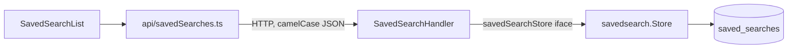

# Implementation Plan: Saved searches

> Spec: [docs/specs/saved-searches.md](docs/specs/saved-searches.md)

## Architecture & design

### Overview
A thin vertical slice across three components — persistence, HTTP, frontend — added with no new infrastructure. Each component is one Task. Persistence is isolated behind a storage boundary so HTTP depends on a local abstraction, not on the database driver; the saved query is stored opaquely so it survives URL-format changes. The shape matches the repo's existing store + handler convention, so nothing new has to be learned to read it.

### Tasks (units)
| Task | Component | Responsibility | Owns (area) | Depends on | Exposes (capability) |
|---|---|---|---|---|---|
| 1 | Storage | All SQL for saved searches | `internal/savedsearch/` | — | list / upsert / delete a user's saved searches |
| 2 | HTTP API | Auth scoping, validation, DTO mapping, routing | `internal/httpapi/` | Task 1 | REST endpoints to list / save / delete a user's searches |
| 3 | Frontend | Fetch wrappers + list UI (run, delete) | `web/src/` (saved-search api + list component) | Task 2 | — (leaf) |

### Boundaries & data flow
Dependency direction is one-way: `httpapi → savedsearch → db`, and on the client `component → api module → fetch`. The `savedsearch` package never imports HTTP types; the handler talks to a local interface that `*savedsearch.Store` satisfies.



### Design decisions
- **Upsert on `(user_id, name)`** over read-then-write: one statement, race-free. Rejected app-level check-then-insert (TOCTOU race).
- **`jsonb` query blob** over normalized filter columns: query shape can evolve without migrations; the spec's scale (tens per user) doesn't need per-filter indexes.
- **Store interface defined in `httpapi`**, not exported from `savedsearch`: the consumer owns the abstraction it needs.

## Tasks

### Task 1 — Storage   (depends on: none · exposes: list / upsert / delete a user's saved searches)

Owns all SQL behind a small store. `Upsert` implements save/rename-by-name in one statement; `List` returns newest first; `Delete` is scoped by `userID` so a user can never delete another user's row. No tests: thin SQL mapping with no branching, and the repo has no DB test harness — behavior is covered through the handler tests in Task 2.

#### Subtask 1.1 — Create the `saved_searches` table · manual

Run this migration before deploying the backend. It creates the table and the unique index the upsert relies on.

```sql
CREATE TABLE saved_searches (
    id          BIGSERIAL PRIMARY KEY,
    user_id     BIGINT      NOT NULL,
    name        TEXT        NOT NULL,
    query       JSONB       NOT NULL,
    created_at  TIMESTAMPTZ NOT NULL DEFAULT now(),
    updated_at  TIMESTAMPTZ NOT NULL DEFAULT now()
);

CREATE UNIQUE INDEX saved_searches_user_name_idx
    ON saved_searches (user_id, name);
```

#### Subtask 1.2 — Store layer
[internal/savedsearch/store.go](internal/savedsearch/store.go) · create

```go
package savedsearch

import (
	"context"
	"encoding/json"
	"time"

	"github.com/jackc/pgx/v5/pgxpool"
)

type SavedSearch struct {
	ID        int64           `json:"id"`
	UserID    int64           `json:"userId"`
	Name      string          `json:"name"`
	Query     json.RawMessage `json:"query"`
	CreatedAt time.Time       `json:"createdAt"`
	UpdatedAt time.Time       `json:"updatedAt"`
}

type Store struct {
	db *pgxpool.Pool
}

func NewStore(db *pgxpool.Pool) *Store {
	return &Store{db: db}
}

func (s *Store) List(ctx context.Context, userID int64) ([]SavedSearch, error) {
	rows, err := s.db.Query(ctx, `
		SELECT id, user_id, name, query, created_at, updated_at
		FROM saved_searches
		WHERE user_id = $1
		ORDER BY created_at DESC`, userID)
	if err != nil {
		return nil, err
	}
	defer rows.Close()

	var out []SavedSearch
	for rows.Next() {
		var ss SavedSearch
		if err := rows.Scan(&ss.ID, &ss.UserID, &ss.Name, &ss.Query, &ss.CreatedAt, &ss.UpdatedAt); err != nil {
			return nil, err
		}
		out = append(out, ss)
	}
	return out, rows.Err()
}

func (s *Store) Upsert(ctx context.Context, userID int64, name string, query json.RawMessage) (SavedSearch, error) {
	var ss SavedSearch
	err := s.db.QueryRow(ctx, `
		INSERT INTO saved_searches (user_id, name, query)
		VALUES ($1, $2, $3)
		ON CONFLICT (user_id, name)
		DO UPDATE SET query = EXCLUDED.query, updated_at = now()
		RETURNING id, user_id, name, query, created_at, updated_at`,
		userID, name, query,
	).Scan(&ss.ID, &ss.UserID, &ss.Name, &ss.Query, &ss.CreatedAt, &ss.UpdatedAt)
	return ss, err
}

func (s *Store) Delete(ctx context.Context, userID, id int64) error {
	_, err := s.db.Exec(ctx, `
		DELETE FROM saved_searches
		WHERE id = $1 AND user_id = $2`, id, userID)
	return err
}
```

### Task 2 — HTTP API   (depends on: Task 1 · exposes: REST list / save / delete endpoints)

Validates input, scopes every call to the authenticated user, maps store rows to camelCase JSON. Depends on the store via the frozen `savedSearchStore` interface so it's unit-testable. Empty/whitespace names are rejected with 400 before any DB call.

#### Subtask 2.1 — HTTP handler
[internal/httpapi/saved_searches.go](internal/httpapi/saved_searches.go) · create

```go
package httpapi

import (
	"context"
	"encoding/json"
	"net/http"
	"strconv"
	"strings"

	"example.com/app/internal/savedsearch"
)

type savedSearchStore interface {
	List(ctx context.Context, userID int64) ([]savedsearch.SavedSearch, error)
	Upsert(ctx context.Context, userID int64, name string, query json.RawMessage) (savedsearch.SavedSearch, error)
	Delete(ctx context.Context, userID, id int64) error
}

type SavedSearchHandler struct {
	store savedSearchStore
}

func NewSavedSearchHandler(store savedSearchStore) *SavedSearchHandler {
	return &SavedSearchHandler{store: store}
}

type saveSearchRequest struct {
	Name  string          `json:"name"`
	Query json.RawMessage `json:"query"`
}

func (h *SavedSearchHandler) List(w http.ResponseWriter, r *http.Request) {
	userID := userIDFromContext(r.Context())
	items, err := h.store.List(r.Context(), userID)
	if err != nil {
		writeError(w, http.StatusInternalServerError, "could not load saved searches")
		return
	}
	writeJSON(w, http.StatusOK, items)
}

func (h *SavedSearchHandler) Save(w http.ResponseWriter, r *http.Request) {
	var req saveSearchRequest
	if err := json.NewDecoder(r.Body).Decode(&req); err != nil {
		writeError(w, http.StatusBadRequest, "invalid request body")
		return
	}
	name := strings.TrimSpace(req.Name)
	if name == "" {
		writeError(w, http.StatusBadRequest, "name is required")
		return
	}

	userID := userIDFromContext(r.Context())
	saved, err := h.store.Upsert(r.Context(), userID, name, req.Query)
	if err != nil {
		writeError(w, http.StatusInternalServerError, "could not save search")
		return
	}
	writeJSON(w, http.StatusCreated, saved)
}

func (h *SavedSearchHandler) Delete(w http.ResponseWriter, r *http.Request) {
	id, err := strconv.ParseInt(r.PathValue("id"), 10, 64)
	if err != nil {
		writeError(w, http.StatusBadRequest, "invalid id")
		return
	}
	userID := userIDFromContext(r.Context())
	if err := h.store.Delete(r.Context(), userID, id); err != nil {
		writeError(w, http.StatusInternalServerError, "could not delete saved search")
		return
	}
	w.WriteHeader(http.StatusNoContent)
}
```

#### Subtask 2.2 — Register routes
[internal/httpapi/router.go](internal/httpapi/router.go) · edit

Wire the handler into the existing authenticated router group, next to the other authenticated resource routes.

```go
	savedSearches := NewSavedSearchHandler(savedsearch.NewStore(db))
	mux.HandleFunc("GET /api/saved-searches", requireAuth(savedSearches.List))
	mux.HandleFunc("POST /api/saved-searches", requireAuth(savedSearches.Save))
	mux.HandleFunc("DELETE /api/saved-searches/{id}", requireAuth(savedSearches.Delete))
```

#### Subtask 2.3 — Handler tests
[internal/httpapi/saved_searches_test.go](internal/httpapi/saved_searches_test.go) · create

Covers:
- saving a valid search returns 201 with the stored entry
- a blank or whitespace-only name is rejected with 400 before the store is called
- an invalid JSON body is rejected with 400
- a store failure surfaces as 500, not a silent success
- deleting with a non-numeric id is rejected with 400

Table-driven per the repo's convention; the fake store implements the frozen `savedSearchStore` interface, so no DB is needed.

```go
package httpapi

import (
	"context"
	"encoding/json"
	"errors"
	"net/http"
	"net/http/httptest"
	"strings"
	"testing"

	"example.com/app/internal/savedsearch"
)

type fakeSavedSearchStore struct {
	upsertCalled bool
	upsertErr    error
}

func (f *fakeSavedSearchStore) List(context.Context, int64) ([]savedsearch.SavedSearch, error) {
	return nil, nil
}

func (f *fakeSavedSearchStore) Upsert(_ context.Context, userID int64, name string, query json.RawMessage) (savedsearch.SavedSearch, error) {
	f.upsertCalled = true
	if f.upsertErr != nil {
		return savedsearch.SavedSearch{}, f.upsertErr
	}
	return savedsearch.SavedSearch{ID: 1, UserID: userID, Name: name, Query: query}, nil
}

func (f *fakeSavedSearchStore) Delete(context.Context, int64, int64) error { return nil }

func TestSavedSearchHandler_Save(t *testing.T) {
	cases := []struct {
		name       string
		body       string
		upsertErr  error
		wantStatus int
		wantUpsert bool
	}{
		{name: "valid search returns 201", body: `{"name":"open tickets","query":{}}`, wantStatus: http.StatusCreated, wantUpsert: true},
		{name: "blank name rejected before store", body: `{"name":"   ","query":{}}`, wantStatus: http.StatusBadRequest, wantUpsert: false},
		{name: "invalid JSON body rejected", body: `{not json`, wantStatus: http.StatusBadRequest, wantUpsert: false},
		{name: "store failure surfaces as 500", body: `{"name":"x","query":{}}`, upsertErr: errors.New("db down"), wantStatus: http.StatusInternalServerError, wantUpsert: true},
	}
	for _, tc := range cases {
		t.Run(tc.name, func(t *testing.T) {
			store := &fakeSavedSearchStore{upsertErr: tc.upsertErr}
			h := NewSavedSearchHandler(store)

			req := httptest.NewRequest(http.MethodPost, "/api/saved-searches", strings.NewReader(tc.body))
			req = req.WithContext(withUserID(req.Context(), 42))
			rec := httptest.NewRecorder()

			h.Save(rec, req)

			if rec.Code != tc.wantStatus {
				t.Fatalf("status = %d, want %d", rec.Code, tc.wantStatus)
			}
			if store.upsertCalled != tc.wantUpsert {
				t.Fatalf("upsert called = %v, want %v", store.upsertCalled, tc.wantUpsert)
			}
		})
	}
}

func TestSavedSearchHandler_Delete(t *testing.T) {
	t.Run("non-numeric id rejected with 400", func(t *testing.T) {
		h := NewSavedSearchHandler(&fakeSavedSearchStore{})

		req := httptest.NewRequest(http.MethodDelete, "/api/saved-searches/abc", nil)
		req.SetPathValue("id", "abc")
		req = req.WithContext(withUserID(req.Context(), 42))
		rec := httptest.NewRecorder()

		h.Delete(rec, req)

		if rec.Code != http.StatusBadRequest {
			t.Fatalf("status = %d, want %d", rec.Code, http.StatusBadRequest)
		}
	})
}
```

### Task 3 — Frontend   (depends on: Task 2 · exposes: nothing)

Typed fetch wrappers plus the list UI. The API module is the only place that calls `fetch`; the component runs a search on click and deletes on demand, loading via the API module on mount. No tests: thin fetch wrappers and presentational rendering with no branching logic, and the repo has no frontend unit-test runner.

#### Subtask 3.1 — Frontend API module
[web/src/api/savedSearches.ts](web/src/api/savedSearches.ts) · create

```ts
export interface SavedSearch {
  id: number;
  userId: number;
  name: string;
  query: SearchQuery;
  createdAt: string;
  updatedAt: string;
}

export async function listSavedSearches(): Promise<SavedSearch[]> {
  const res = await fetch("/api/saved-searches", { credentials: "include" });
  if (!res.ok) throw new Error("Failed to load saved searches");
  return res.json();
}

export async function saveSearch(
  name: string,
  query: SearchQuery,
): Promise<SavedSearch> {
  const res = await fetch("/api/saved-searches", {
    method: "POST",
    headers: { "Content-Type": "application/json" },
    credentials: "include",
    body: JSON.stringify({ name, query }),
  });
  if (!res.ok) throw new Error("Failed to save search");
  return res.json();
}

export async function deleteSavedSearch(id: number): Promise<void> {
  const res = await fetch(`/api/saved-searches/${id}`, {
    method: "DELETE",
    credentials: "include",
  });
  if (!res.ok) throw new Error("Failed to delete saved search");
}
```

#### Subtask 3.2 — Saved-search list component
[web/src/components/SavedSearchList.tsx](web/src/components/SavedSearchList.tsx) · create

Renders the user's saved searches, runs one on click, supports delete. Loads via the API module on mount.

```tsx
import { useEffect, useState } from "react";
import {
  type SavedSearch,
  deleteSavedSearch,
  listSavedSearches,
} from "../api/savedSearches";

interface Props {
  onRun: (search: SavedSearch) => void;
}

export function SavedSearchList({ onRun }: Props) {
  const [items, setItems] = useState<SavedSearch[]>([]);

  useEffect(() => {
    listSavedSearches().then(setItems).catch(console.error);
  }, []);

  async function handleDelete(id: number) {
    await deleteSavedSearch(id);
    setItems((prev) => prev.filter((s) => s.id !== id));
  }

  if (items.length === 0) {
    return <p className="saved-searches-empty">No saved searches yet.</p>;
  }

  return (
    <ul className="saved-searches">
      {items.map((search) => (
        <li key={search.id}>
          <button type="button" onClick={() => onRun(search)}>
            {search.name}
          </button>
          <button
            type="button"
            aria-label={`Delete ${search.name}`}
            onClick={() => handleDelete(search.id)}
          >
            ×
          </button>
        </li>
      ))}
    </ul>
  );
}
```

## Verification
- [ ] `go build ./...`
- [ ] `go vet ./...` and `golangci-lint run`
- [ ] `go test ./internal/...`
- [ ] `cd web && npm run typecheck && npm run lint`
